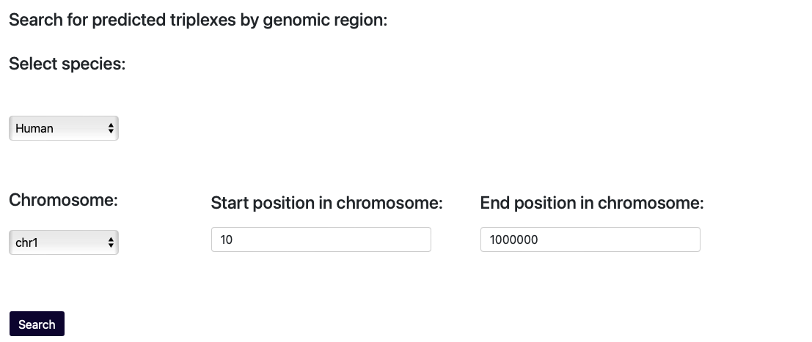
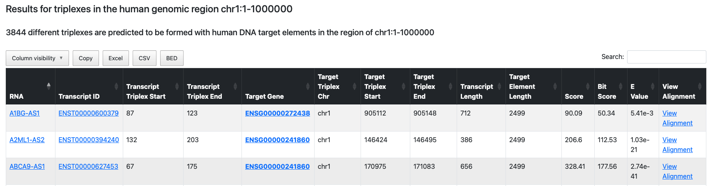

===========================
Example TripLexicon queries
===========================

In this section, we will provide specific examples for each of the possible TripLexicon queries. 

Querying by RNA
=========================
Summary query by RNA gene symbol
---------------------------
This example reflects a scenario where the user has an RNA of interest, but might not have in mind which specific transcript of the RNA gene is of interest. In this case, they can query TripLexicon by the RNA gene symbol, and the results will be the predicted triplexes of the respective RNA gene summarized at the transcript level. They will be ordered such that the transcript forming the most predicted triplexes is listed first. This query is supposed to help the user get an overview of the different transcripts belonging to an RNA gene and how often they are involved in predicted triplex forming events.

For this query mode, the user should navigate to the :kbd:`RNA query` tab. 

Here he is presented with 3 query options. In order to run the summary query by RNA gene symbol, the RNA gene of interest needs to be provided to the first input field :kbd:`Search for triplex summary by RNA genesymbol`. Upon clicking :kbd:`Search`, the query will begin to run. For example, the user may be interested in the known triplex-forming lncRNA *MEG3*.

.. image:: ../RNA_summary_search_MEG3.png
  :alt: Summary query by RNA gene MEG3

Once the query has successfully run, the results table should load automatically. At the top of the page, a summary statement should state how many predicted triplexes there are for the RNA gene which was used for the query. In the case of *MEG3*, this reads 1605, as of the current version of TripLexicon. The results table is sorted by the number of predicted triplexes for each transcript. For MEG3 the transcript with the most predicted tripelxes is ENST00000522771. Of the transcript with the most predicted triplexes, a plot of the triplex forming region prediction for the maximally scoring transcript is shown at the bottom of the page. The user may also sort the table by other fields by clicking on the column header, or can search the table for specific terms by using the search bar at the top right of the table. Which columns are shown can also be modified by the user via the :kbd:`Column visibility` dropdown. The results table can be copied to the clipboard, or exported to :kbd:`Excel`, :kbd:`CSV` or :kbd:`PDF` formats using the buttons at the top of the table.

.. image:: ../RNA_summary_results_MEG3.png
  :alt: Summary query results for RNA gene MEG3

The transcript IDs in the :kbd:`Transcript ID` column are linked to detail pages of the respective transcripts. Upon clicking the transcript ID, the user is redirected to the transcript detail page where information of the particular transcript is provided. A plot of the triplex forming region prediction for the respective transcript is shown on the detail page as well.

.. image:: ../transcript_detail.png
  :alt: Transcript detail example for ENST00000556407

Querying by RNA gene symbol
---------------------------
The query by RNA gene symbol reflects a similar scenario to the one for the summary query by RNA gene symbol decsribed above. The user has an RNA of interest, but might not have in mind which specific transcript of the RNA gene is of interest. Instead of querying the database such that the predicted triplexes per transcript are summarized, each single predicted triplex is listed and can be investigated in more detail. In this case, they can query TripLexicon by the RNA gene symbol in the detailed mode, and the results will include statistically significant predicted triplexes for all of the annotated transcripts for that RNA gene.

Keeping the known triplex-forming lncRNA *MEG3* as our example, the user again needs to navigate to the :kbd:`RNA query` tab. To query TripLexicon for triplexes that are predicted to be formed between any transcript of *MEG3* and genome-wide promoters/REMs, they can provide ´MEG3´ to the second search field, **Search for predicted triplexes by RNA gene symbol**. Submitting the query by clicking :kbd:`Search`, will initiate the search. Once the query has successfully run, the results table should load automatically. At the top of the page, a summary statement should state how many predicted triplexes there are for the RNA gene which was used for the query. In the case of *MEG3*, this reads 1605, as of the current version of TripLexicon.

.. image:: ../RNA_gene_sym_query.png
  :alt: Query by RNA gene MEG3

The results table is - by default - sorted by the *E* value for the predicted triplexes, as calculated by TriplexAligner. This places the most statistically significant predicted triplexes at the top of the table. In the case of *MEG3*, the most significant predicted interaction is with the gene *MIR770*.  The sorting, column visibility and export options are identical to those described above in the example for **Summary query by RNA gene symbol**. 

The transcript IDs in the :kbd:`Transcript ID` column are linked to detail pages of the respective transcripts. Upon clicking the transcript ID, the user is redirected to the transcript detail page where information of the particular transcript is provided. A plot of the triplex forming region prediction for the respective transcript is shown on the detail page as well. The gene symbol names are linked to the summary query by RNA gene symbol results page. The information given with this detail page is described in the previous section.

**Screenshots for each stage of the search process (search by RNA tab, search by symbol, results)**

Querying by RNA transcript ID
-----------------------------
This example reflects a scenario where the user has an RNA of interest, and is interested in the predicted triplex formation of a specific transcript of that RNA (e.g. that which is dominantly expressed in their cell type of interest, or a specific splice variant). In this case, they can query TripLexicon by the RNA transcript ID (in Ensembl format), and the results will include statistically significant predicted triplexes for only the specified transcript for that RNA gene.

Sticking to the example of *MEG3*, but this time the user is only interested in the canonical Ensembl transcript, which has the ID *ENST00000556407*. In this case, the user would again navigate to the :kbd:`RNA query` tab of the TripLexicon web interface, and this time would enter *ENST00000556407* into the third search field on the card with the title **Search for predicted triplexes by RNA transcript ID**. 

.. image:: ../transcript_search.png
  :alt: Query by transcript ENST00000556407

After clicking :kbd:`Search`, the query will begin to run. Upon completion, the results table for predicted triplexes between *ENST00000556407* and GRCh38 promoters/REMs will be rendered. Again, a summary statement at the top of the results table will summarise how many predicted triplexes there are for the supplied transcript. In the case of *ENST00000556407*, for the current version of TripLexicon, this should read "ENST00000556407 is predicted to be involved in the formation of 6 triplexes". The sorting, column visibility and export options are identical to those described above in the example for **Summary query by RNA gene symbol**. 

Querying by predicted target gene
=================================
This use case reflects a scenario where the user has a gene of interest (e.g. a differentally expressed gene from RNA-sequencing), and is interested in knowing whether the gene might be be subject to regulation via triplex formation by a lncRNA. Here, the user would navigate to the :kbd:`Target query` tab of TripLexicon.

There the user can supply their target gene symbol of interest to the search field e.g. "*GAPDH*". Upon clicking :kbd:`Search`, the query will begin to run. As the database of target elements is large, this query can take some time to run.

.. image:: ../target_search.png
  :alt: Target Search

Upon completion, the results table for statistically significant triplexes predicted to form between human lncRNAs and promoters/REMs associated with *GAPDH* will render. A statement at the top of the results table will summarise the total number of triplexes predicted to form at gene regulatory elements of *GAPDH*, and for the current version of TripLexicon this should read "Gene GAPDH is predicted to be targeted by different RNAs to form 16 triplexes.". The sorting, column visibility and export options are identical to those described above in the example for **Summary query by RNA gene symbol**. The transcript and RNA gene links render the transcript and gene detail pages, respectively, as described for **Querying by RNA gene symbol**.

Querying by a genomic region
============================
In order to query Triplexicon for target elements located in defined genomic regions, the user needs to navigate to the **Region query** tab.

.. image:: ../Region_query.png
  :alt: Region Query

Single region
-------------
If the user has an interest in a single region of the genome (e.g. a topologically associating domain identified in Hi-C data), then they can use the dropdown and search fields of the **Region query** tab of TripLexicon to provide the coordinates. For example, if a user was interested in a region of approximately 1 megabase around the gene locus of *ACTB*, they could use the :kbd:`Chromosome` dropdown to select :kbd:`chr7`, and then the :kbd:`Start position in chromosome` and :kbd:`Stop position in chromosome` text fields to input :kbd:`5000000` and :kbd:`6000000`, respectively. Depending on the size of the supplied region, this query might take some time to run.

After selecting/entering the appropriate values, the user can start the query by clicking :kbd:`Search`. Upon completion of the query, the results table containing all statistically significant triplexes predicted between lncRNAs and gene regulatory elements falling within the specified region will be rendered. The sorting, column visibility and export options are identical to those described above in the example for **Summary query by RNA gene symbol**. The transcript and RNA gene links render the transcript and gene detail pages, respectively, as described for **Querying by RNA gene symbol**.

Multiple regions
----------------
More often the case might be that the user has many genomic regions in which they would like to search for predicted triplexes. For example, these could be peaks which are the result of other assays, such as ATAC-sequencing, ChIP-sequencing/CUT&RUN, or specific sets of promoters of genes which are differentially expressed in an RNA-sequencing experiment. In this case, rather than querying individual regions, a BED file can be used to query multiple regions simultaneously. The BED file should have a minimum of three columns (chromosome, start, stop), with a "chr" prefix. Extra columns are permitted, but are not used in the query. An example BED file is available from the `TripLexicon GitHub repository <https://github.com/SchulzLab/TripLexicon/blob/main/TriplexDB/Test_bed_file_for_triplexaligner.bed>`_ , and is also shown below in table format.

.. list-table:: Example BED file format
   :widths: 25 25 25
   :header-rows: 0

   * - chr1
     - 1
     - 10000
   * - chr5
     - 10000
     - 20000
   * - chr7
     - 30000
     - 40000
   * - chr8
     - 40000
     - 50000
   * - chr10
     - 50000
     - 60000

To upload the BED file, the user should click the :kbd:`Choose File` button on the **Region query** tab of TriplexAligner.

.. image:: ../choose_file.png
  :alt: Choose file

This should bring up the operating system-dependent file explorer, where the user can point to the appropriate file for the regions of interest e.g. :kbd:`regions_of_interest.bed`. Following this, the user can click :kbd:`Submit file` to upload and the chosen BED file for querying. This should start the TripLexicon query.

.. image:: ../submit_file.png
  :alt: Submit file

Upon completion, the results table containing the predicted triplexes between lncRNAs and gene regulatory elements residing in the supplied regions will be rendered. Depending on the size of the supplied regions, this query might take some time to run. The sorting, column visibility and export options are identical to those described above in the example for **Querying by RNA gene symbol**.

.. image:: ../bed_results.png
  :alt: Bed results
