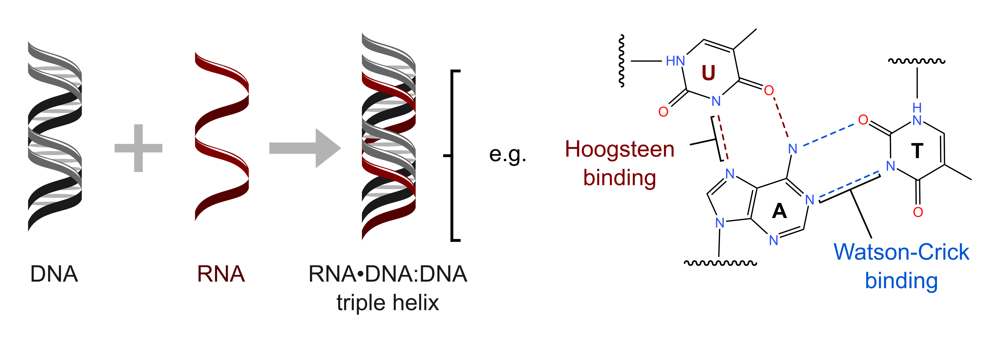
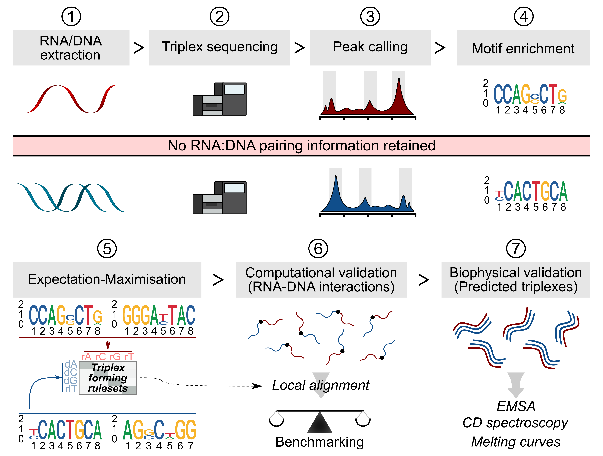
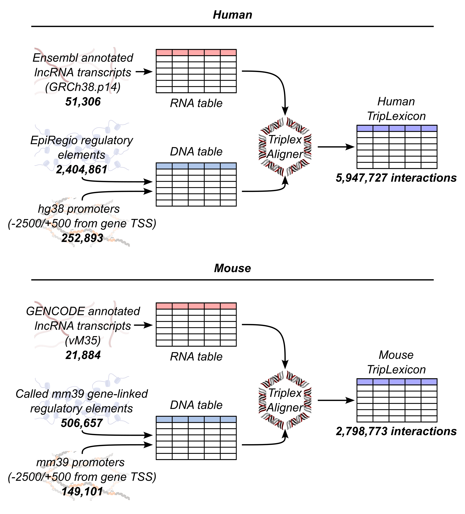

==================
About TripLexicon
==================

TripLexicon is a web server which allows users to access and analyse predicted gene regulatory RNA:DNA:DNA triplexes in human and mouse. The triplexes were predicted using `TriplexAligner <https://github.com/SchulzLab/TriplexAligner>`_.

What is an RNA:DNA:DNA triplex?
===============================

An ever-increasing body of evidence has demonstrated that RNA molecules are not merely messengers but can also act as gene regulatory factors. One mechanism through which RNA-based gene regulation occurs is the formation of physical interactions between RNA and DNA. The binding of an RNA molecule to a specific DNA region can facilitate the regulation of adjacent genes through the actions of RNA-binding proteins that are recruited via their interaction with the RNA.

    
    Schematic of RNA:DNA:DNA triplex formation, adapted from Warwick *et al*., *Briefings in Bioinformatics* (2022) 

RNA-DNA interactions can also occur through the formation of RNA:DNA:DNA triple helices, known as triplexes. In a triplex, the single-stranded RNA binds within the major groove of the double-stranded DNA through Hoogsteen base pairing, while the DNA conformation remains intact (unlike in the formation of R-loops, another type of RNA-DNA interaction). Hoogsteen base pairing, and therefore triplex formation, are sequence-specific. This has led to the hypothesis that RNA, particularly non-coding RNA, contributes to the precise control of gene expression.

However, molecular methods for the identification and characterization of triplexes remain highly complex. This has made the computational prediction of triplexes a key method in non-coding RNA research.

Prediction of RNA:DNA:DNA triplexes with TriplexAligner
=======================================================

Prediction of triplex formation has traditionally utilised biophysical data on RNA:DNA:DNA base triplet binding affinities to predict whether RNA and DNA sequences are likely to form a triplex or not. This approach - whilst valid - suffers from the environment in which biophysical experiments on triplex formation are performed. Specifically, biophysical measurements are obtained from nucleotide constructs in the absence of the wider cellular context (chromatin, RNA-binding proteins, RNA and DNA secondary structure etc.). 

In an alternative approach, TriplexAligner was developed using triplexRNA- and triplexDNA-sequencing data generated from cells in culture. Through using expectation-maximisation to learn triplex RNA-DNA nucleotide binding probabilities, a number of triplex RNA-DNA scoring matrices were derived, which are subsequently utilised to score local alignments between RNA and DNA sequences in TriplexAligner. This approach was shown to outperform previously published methods (Triplexator, LongTarget) in the accurate recall of RNA-DNA interactions detected in RADICL-sequencing and Red-C data. By using TriplexAligner to predict triplex formation between lncRNAs and gene regulatory elements (promoters and regulatory elements from EpiRegio (Baumgarten *et al.* (2020) or *de novo* called murine enhancers)), we have assembled TripLexicon, a database of predicted gene regulatory RNA:DNA:DNA triplexes. The predicted interactions available via TripLexicon were predicted using a modified version of TriplexAligner, where the scoring matrices were used in combination with `last <https://gitlab.com/mcfrith/last>`_ in order to enhance scalability.

    Development of TriplexAligner, adapted from Warwick *et al*., *Briefings in Bioinformatics* (2022) 

What information does TripLexicon hold?
=======================================

At the current time, TripLexicon holds predicted RNA:DNA:DNA triplexes between human and murine lncRNAs (as annotated in GENCODE v45 & GENCODE vM35, respectively) and the following putative gene regulatory elements:

GRCh38/GRCm39 promoter regions (+2000,-500 base pairs from annotated transcription start site)
---------------------------------------------------------------------------------------

Promoter regions were designated as being within a window between 2000 base pairs upstream and 500 base pairs downstream of any annotated transcription start site in the GRCh38.p14 and GRCm39 genome assemblies.

EpiRegio regulatory elements
----------------------------

`EpiRegio <https://epiregio.de/>`_ is a web-server housing information on gene regulatory elements (REMs), which have been linked to target genes via the machine learning approach `STITCHIT <https://academic.oup.com/nar/article/49/18/10397/6368526>`_. The learning of REMs and their target genes relied upon DNase-sequencing and RNA-sequencing data from several consortia, and was validated using external data on three-dimensional genome conformation. These REMs are combined with the aforementioned promoter regions to make up the DNA part of TripLexicon (see schematic, below)

Mouse enhancers called from ENCODE ATAC-sequencing data
-------------------------------------------------------

In the absence of a standardies, gene-linked set of enhancer regions for GRCm39, we used `STARE <https://github.com/SchulzLab/STARE>`_ to generate a set of gene-linked ATAC-sequencing peaks, utilising data from each murine cell type held in the `ENCODE <https://www.encodeproject.org/>`_ project. Each sample was analyzed identically by being aligned to the GRCm39 reference genome, followed by peak calling with MACS3. STARE was used to link union peaks from across each sample to genes, using the adapted activity-by-contact model implemented in the algorithm, in a distance-based manner. Peaks were considered to be linked to genes if an adapted ABC score between the two elements was greater than 0.02.

GENCODE v45 / Ensembl release 112 (human) and GENCODE vM35 lncRNAs
-----------------------------------------

The genomic sequences of the gene regulatory elements described above were used as input to TriplexAligner, along with transcript sequences of lncRNAs annotated in either GENCODE v45 (human, sequences from Ensembl release 112) or GENCODE vM35 (mouse), to produce predicted RNA:DNA:DNA triplexes.

A graphical summary of TripLexicon/TriplexAligner is shown below:

